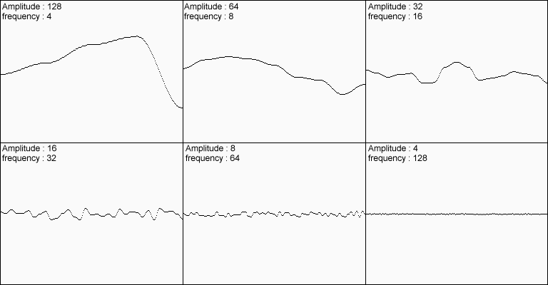
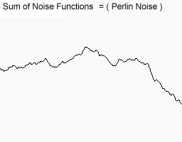

## TERRAIN GENERATOR
In game industry, AAA game companies prepares their own tools for generating terrains. For example game called “No Man’s Sky” generates procedural planets. Procedural generation meaning by the way is a method of creating data algorithmically as opposed to manually, typically through a combination of human-generated assets and algorithms coupled with computer-generated randomness and processing power. In computer graphics, it is commonly used to create textures and 3D models. Example video about procedural generation from “No Man’s Sky”: https://www.youtube.com/watch?v=PM7ArMxUFR0&feature=emb_title

In this project I made my own procedural terrain generator in Unity3D and explain how it works below. Let’s get start!

### Create a mesh from scratch
Apply perlin noise algorithm to generate procedural mountains/hills.
Assign material controlled by a specific shader to the mesh. (In this part I coded my own shader)
#### Result:

As you can see here we get procedural mountain like shape with specific material. In our shader, it chooses different texture for each vertex depending on steepness of terrain with vertex coloring method. But result is not something we want. We want to have much realistic looking terrain. In this case we use different method.

#### Octaves:
Simple perlin noise algorithm looks like this in one dimension (With different height and scale values)

As you can see, we can change height and scale values of signal. If we add them all, we get something like this:

If we apply this in our terrain

Yes..! It looks much better than before. So perlin noise is a simple and powerful algorithm but not enough if we use it alone. We need to make some changes like adding, scaling… on it.  

### Adding Sea Threshold Value:

If we want to add sea to our terrain, we know that we should make our seas bigger to get realistic nature. When we give threshold value, heights that are lower than threshold will be calculated different than values above threshold.

Algorithm:
if (height < treshold)
       return treshold - ((treshold - height) / seaDeep);
else
       return height;

Then we get a curve like this:

### Adding Sea

I have coded my own shader to get sea. I will not explain how I did in this part but we explain briefly later on.

### Adding Vegetation and Natural Objects

The other challenging part was adding vegetation objects. To remind, vegetation objects are modelled with blender 2.8. They spawned still using perlin noise algorithm. If you ever observe grasses in real life, we can see small grasses around bigger bushes. But how we will implement that? It is quite simple. Recall that we can generate mountains with perlin noise. We ignore values below threshold value and spawn bigger bushes at peak points of our signal. The picture below helps you to understand algorithm clearly.

### Desert

### SeaSide

## Conclusion
To sum up, perlin noise is a very powerful and basic algorithm in industry of games, films, art… We can manipulate it with adding, scaling, giving threshold values and more on to the noise signal.

